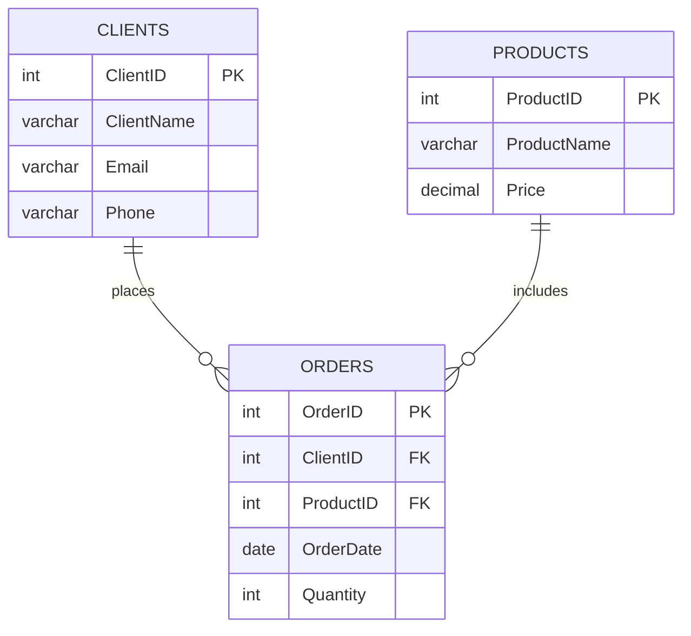

# **Practical Assignment 01**

### **_Purpose_**: Practice with writing select queries.

### Basic requirements (for 5 points):

* Write complex select with joining 5 tables, using _where_ clause, _group by_ and _order by_. 
* Be able to explain your solution using the correct terminology.

### Additional points (for 2 points):

* Source code published in GitHub or GitLab **+0.5**
* Union or union all **+0.5**
* CTE **+1**

### Helper

`script.sql` file can help you with syntax. This is simplified example of your assignment.
_You **can not** use the same tables' structure in your assignment._

ERD:

