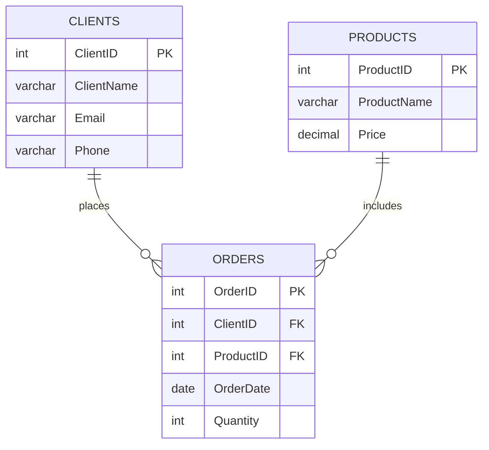

# **Practical Assignment 01**

**_Purpose_**: Practice with writing select queries.

### Basic requirements:

Write complex select with joining 5 tables,
using where clause. 
Be able to explain your solution using the correct terminology.
5 points

### Additional points:

Source code published in GitLab +0.5
Union or union all +0.5
CTE + 1

### Helper

`script.sql` file can help you with syntax. This is simplified example of your assignment.
_You **can not** use the same tables structure in your assignment._

ERD:

